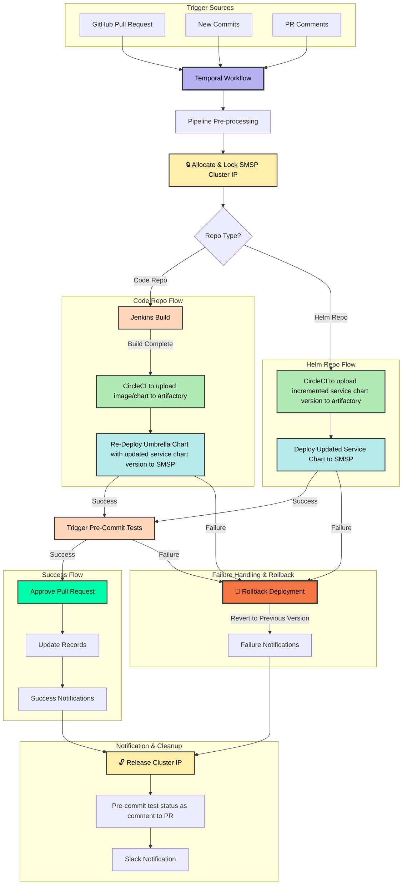
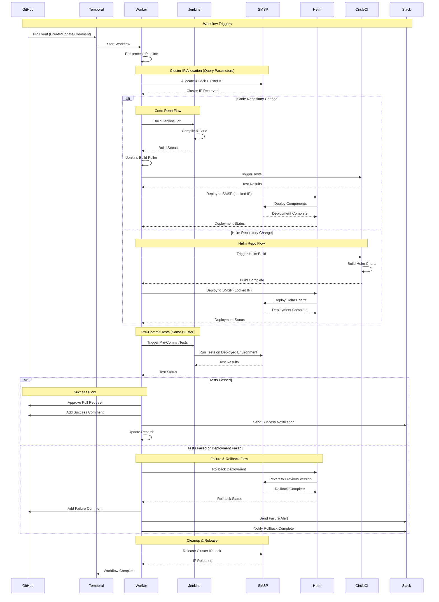

# CI/CD Pipeline Workflow Diagrams

## Comprehensive CI/CD Pipeline Workflow

```mermaid
graph TD
    subgraph "Trigger Sources"
        PR[GitHub Pull Request]
        COMMIT[New Commits]
        COMMENT[PR Comments]
    end
    
    PR --> TW[Temporal Workflow]
    COMMIT --> TW
    COMMENT --> TW
    
    TW --> PP[Pipeline Pre-processing]
    PP --> LOCK[🔒 Allocate & Lock SMSP Cluster IP]
    LOCK -->  REPO_TYPE{Repo Type?}
    REPO_TYPE --> |Code Repo| JENKINS[Jenkins Build]
    REPO_TYPE --> |Helm Repo| CIRCLECI_HELM[CircleCI to upload incremented service chart version to artifactory]
    
    subgraph "Code Repo Flow"
        JENKINS --> |Build Complete| CIRCLECI_CODE[CircleCI to upload image/chart to artifactory]
        CIRCLECI_CODE --> DEPLOY_CODE[Re-Deploy Umbrella Chart with updated service chart version to SMSP]
    end
    
    subgraph "Helm Repo Flow"
        CIRCLECI_HELM --> DEPLOY_HELM[Deploy Updated Service Chart to SMSP]
    end
    
    DEPLOY_CODE --> |Success| PRECOMMIT[Trigger Pre-Commit Tests]
    DEPLOY_CODE --> |Failure| ROLLBACK
    DEPLOY_HELM --> |Success| PRECOMMIT
    DEPLOY_HELM --> |Failure| ROLLBACK
    
    PRECOMMIT --> |Success| APPROVE[Approve Pull Request]
    PRECOMMIT --> |Failure| ROLLBACK[🔄 Rollback Deployment]
    
    subgraph "Failure Handling & Rollback"
        ROLLBACK --> |Revert to Previous Version| NOTIFY_FAIL[Failure Notifications]
    end
    
    subgraph "Success Flow"
        APPROVE --> UPDATE_RECORD[Update Records]
        UPDATE_RECORD --> NOTIFY_SUCCESS[Success Notifications]
    end
    
    subgraph "Notification & Cleanup"
        NOTIFY_SUCCESS -->  UNLOCK[🔓 Release Cluster IP]
        NOTIFY_FAIL -->  UNLOCK[🔓 Release Cluster IP]
        UNLOCK --> GITHUB_COMMENT[ Pre-commit test status as comment to PR]
        GITHUB_COMMENT --> SLACK_NOTIFY[Slack Notification] 
    end
    
    style TW fill:#B7B1F2,stroke:#333,stroke-width:3px,color:#000
    style LOCK fill:#FFEEA9,stroke:#333,stroke-width:2px,color:#000
    style JENKINS fill:#FFD6BA,stroke:#333,stroke-width:2px,color:#000
    style CIRCLECI_CODE fill:#B0EBB4,stroke:#333,stroke-width:2px,color:#000
    style CIRCLECI_HELM fill:#B0EBB4,stroke:#333,stroke-width:2px,color:#000
    style DEPLOY_CODE fill:#B5EAEA,stroke:#333,stroke-width:2px,color:#000
    style DEPLOY_HELM fill:#B5EAEA,stroke:#333,stroke-width:2px,color:#000
    style PRECOMMIT fill:#FFD6BA,stroke:#333,stroke-width:2px,color:#000
    style APPROVE fill:#00FFAB,stroke:#333,stroke-width:2px,color:#000
    style ROLLBACK fill:#F47645,stroke:#333,stroke-width:3px,color:#000
    style UNLOCK fill:#FFEEA9,stroke:#333,stroke-width:2px,color:#000
```

## Detailed Component Interaction Flow

```mermaid
sequenceDiagram
    participant GitHub
    participant Temporal
    participant Worker
    participant Jenkins
    participant SMSP
    participant Helm
    participant CircleCI
    participant Slack
    
    Note over GitHub,Slack: Workflow Triggers
    GitHub->>Temporal: PR Event (Create/Update/Comment)
    Temporal->>Worker: Start Workflow
    Worker->>Worker: Pre-process Pipeline
    
    Note over Worker,SMSP: Cluster IP Allocation (Query Parameters)
    Worker->>SMSP: Allocate & Lock Cluster IP
    SMSP-->>Worker: Cluster IP Reserved
    
    alt Code Repository Change
        Note over Worker,Jenkins: Code Repo Flow
        Worker->>Jenkins: Build Jenkins Job
        Jenkins->>Jenkins: Compile & Build
        Jenkins-->>Worker: Build Status
        Worker->>Worker: Jenkins Build Poller
        
        Worker->>CircleCI: Trigger Tests
        CircleCI-->>Worker: Test Results
        
        Worker->>Helm: Deploy to SMSP (Locked IP)
        Helm->>SMSP: Deploy Components
        SMSP-->>Helm: Deployment Complete
        Helm-->>Worker: Deployment Status
        
    else Helm Repository Change
        Note over Worker,CircleCI: Helm Repo Flow
        Worker->>CircleCI: Trigger Helm Build
        CircleCI->>CircleCI: Build Helm Charts
        CircleCI-->>Worker: Build Complete
        
        Worker->>Helm: Deploy to SMSP (Locked IP)
        Helm->>SMSP: Deploy Helm Charts
        SMSP-->>Helm: Deployment Complete
        Helm-->>Worker: Deployment Status
    end
    
    Note over Worker,Jenkins: Pre-Commit Tests (Same Cluster)
    Worker->>Jenkins: Trigger Pre-Commit Tests
    Jenkins->>SMSP: Run Tests on Deployed Environment
    SMSP-->>Jenkins: Test Results
    Jenkins-->>Worker: Test Status
    
    alt Tests Passed
        Note over Worker,GitHub: Success Flow
        Worker->>GitHub: Approve Pull Request
        Worker->>GitHub: Add Success Comment
        Worker->>Slack: Send Success Notification
        Worker->>Worker: Update Records
        
    else Tests Failed or Deployment Failed
        Note over Worker,Helm: Failure & Rollback Flow
        Worker->>Helm: Rollback Deployment
        Helm->>SMSP: Revert to Previous Version
        SMSP-->>Helm: Rollback Complete
        Helm-->>Worker: Rollback Status
        
        Worker->>GitHub: Add Failure Comment
        Worker->>Slack: Send Failure Alert
        Worker->>Slack: Notify Rollback Complete
    end
    
    Note over Worker,SMSP: Cleanup & Release
    Worker->>SMSP: Release Cluster IP Lock
    SMSP-->>Worker: IP Released
    Worker->>Temporal: Workflow Complete
```
